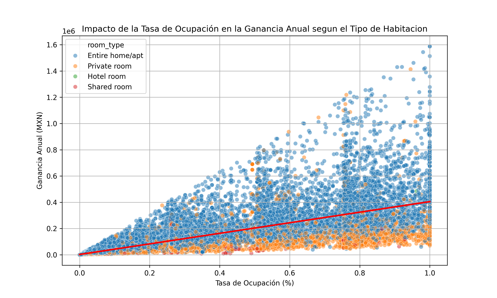
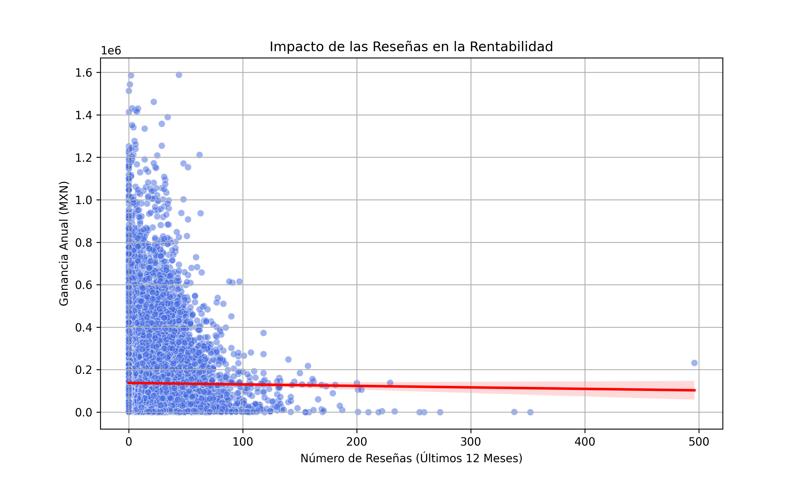
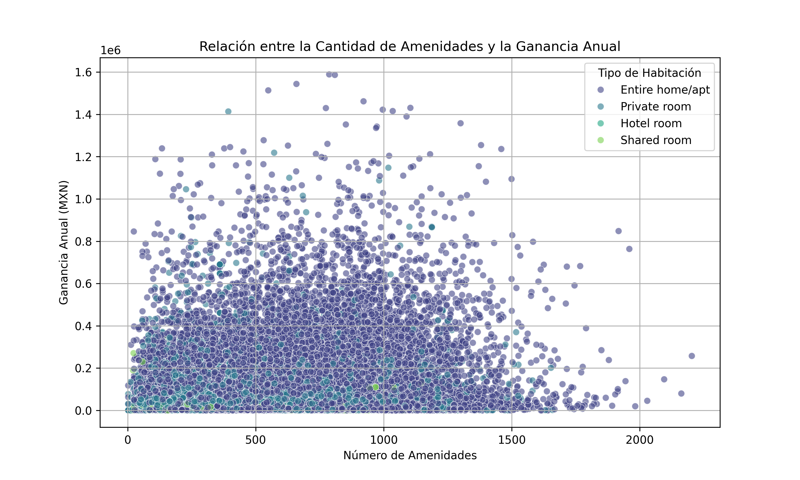
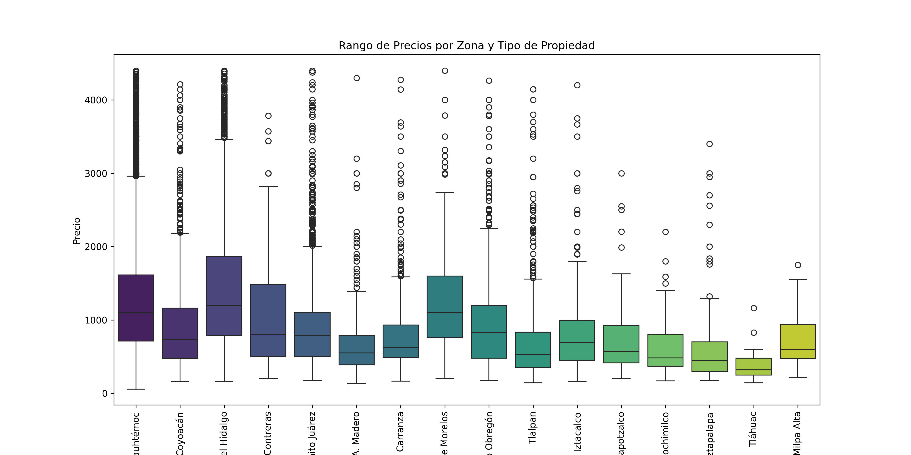
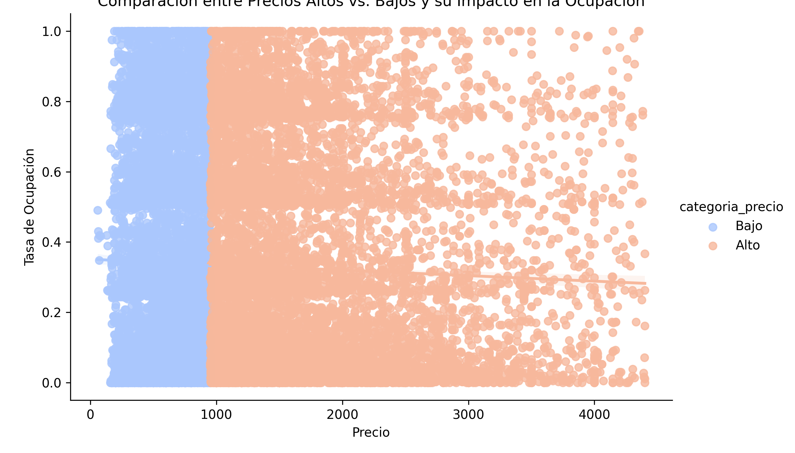
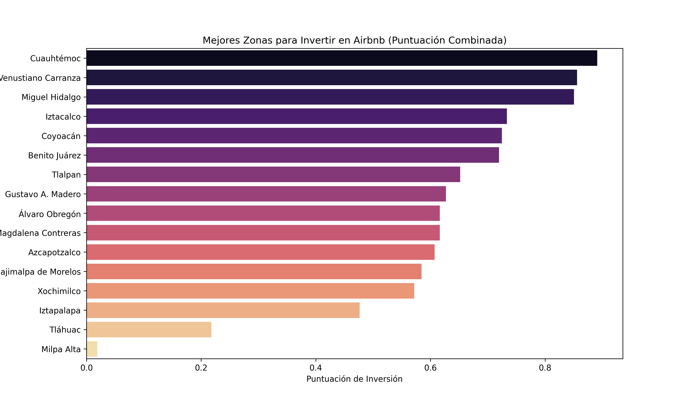
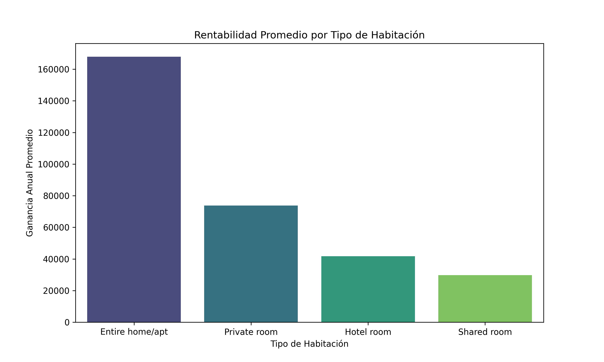
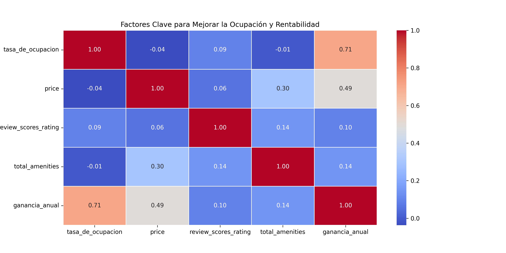

# Análisis de Airbnb en la Ciudad de México

Este documento detalla los análisis realizados sobre los listados de Airbnb en la Ciudad de México, incluyendo la metodología utilizada, las variables analizadas y las conclusiones obtenidas.

## 1. Objetivo del Análisis
Este proyecto tiene como propósito responder diferentes preguntas analíticas relacionadas con el precio, la disponibilidad y el número de reseñas, considerando variables clave como la zona (neighbourhood) y el tipo de habitación (room_type). A través de este análisis, se busca identificar las mejores zonas y tipos de alojamiento para realizar inversiones rentables en Airbnb.

## 2. Variables Analizadas

## 3. Análisis de Rentabilidad y Factores Clave
- **Relación entre precio y ganancia anual**

En este gráfico observamos que la ganancia anual estimada tiende a aumentar conforme se incrementa el precio por noche. Existe una relación positiva clara, lo que indica que los listados con tarifas más altas tienen el potencial de generar mayores ingresos anuales.
Sin embargo, también notamos que la dispersión de los datos varía según el precio por noche. Para los precios más bajos, la dispersión de las ganancias es menor, lo que sugiere una mayor previsibilidad en los ingresos. En cambio, a medida que el precio por noche aumenta, la dispersión también se amplía, indicando que algunos listados logran ingresos significativamente altos, mientras que otros no necesariamente alcanzan el mismo nivel de rentabilidad.
Al analizar por tipo de habitación, observamos que los apartamentos y casas enteras ("Entire home/apt") dominan el rango de precios más altos y, en consecuencia, presentan una mayor variabilidad en las ganancias anuales. Las habitaciones privadas ("Private room") se encuentran en un rango de precios más bajo y muestran menor dispersión en la ganancia anual. En cuanto a las habitaciones de hotel ("Hotel room") y habitaciones compartidas ("Shared room"), aparecen en menor cantidad y con precios más moderados.
En general, el gráfico confirma que la inversión en listados con precios más altos puede ser rentable, pero con un grado de variabilidad significativo en los resultados. Esto sugiere que, además del precio, otros factores como la ocupación, la ubicación y las amenidades pueden desempeñar un papel clave en la rentabilidad final de cada propiedad.

- **Impacto de la tasa de ocupación**

En este gráfico podemos observar que la ganancia anual estimada tiende a aumentar a medida que la tasa de ocupación incrementa. Existe una correlación positiva, lo que sugiere que los listados con mayor ocupación logran generar mayores ingresos anuales.
A diferencia del gráfico anterior, donde el precio por noche tenía una dispersión más amplia en las ganancias, aquí la dispersión es menor, aunque aún presente. Esto indica que si bien una mayor tasa de ocupación es clave para aumentar las ganancias, otros factores como el precio, la ubicación y las amenidades también juegan un papel importante en la rentabilidad total.
Al analizar los distintos tipos de habitación, podemos notar que las casas y apartamentos enteros ("Entire home/apt") son los listados con la tasa de ocupación más alta y también los que generan mayores ingresos anuales. En contraste, las habitaciones privadas ("Private room"), aunque presentes en el gráfico, tienden a concentrarse en niveles de ganancia más bajos.
En general, este análisis confirma que una mayor tasa de ocupación es un factor clave para la rentabilidad, pero su impacto puede variar dependiendo del tipo de alojamiento y de otros factores estratégicos en la inversión.

- **Efecto de las reseñas a la rentabilidad**

En este gráfico podemos observar que el número de reseñas en los últimos 12 meses no parece estar fuertemente relacionado con la ganancia anual. A diferencia de otras variables, la dispersión de los puntos muestra que incluso listados con pocas reseñas pueden generar ingresos significativamente altos. La tendencia de regresión sugiere que un mayor número de reseñas no necesariamente se traduce en mayores ganancias. 

- **Relación entre la cantidad de amenidades y la ganancia anual**

En este gráfico podemos observar que el número de amenidades ofrecidas en un alojamiento no tiene una relación clara con las ganancias anuales. Aunque podríamos suponer que una mayor cantidad de amenidades podría traducirse en una mejor experiencia para los huéspedes y, por lo tanto, en mayores ingresos, la dispersión de los puntos indica que no existe una correlación fuerte entre ambas variables. Si bien algunos listados con muchas amenidades logran altos ingresos, también hay listados con pocas amenidades que generan ganancias similares o incluso mayores.

**Comparación de Zonas y Tipos de Propiedades**
- **Zonas con los listados más rentables**

**Estrategia de Precios y Amenidades Clave**
- **Rango de precios por zona y tipo de propiedad**

- **Comparación entre precios altos vs. bajos y su impacto en la ocupación**

## 4. Conclusiones y Recomendaciones Finales
- **Mejores zonas para invertir**

- **Mejor tipo de habitación para rentabilidad**

- **Estrategias para mejorar la ocupación y precios**

