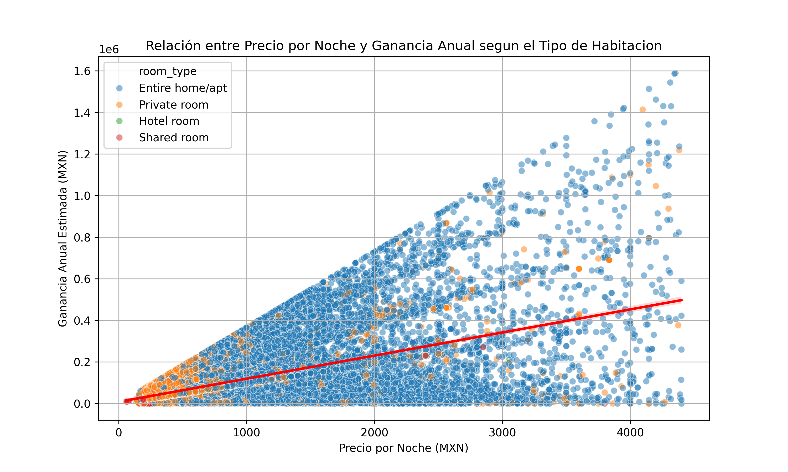

# Análisis de Airbnb en la Ciudad de México

Este documento detalla los análisis realizados sobre los listados de Airbnb en la Ciudad de México, incluyendo la metodología utilizada, las variables analizadas y las conclusiones obtenidas.

## 1. Objetivo del Análisis
Este proyecto tiene como propósito responder diferentes preguntas analíticas relacionadas con el precio, la disponibilidad y el número de reseñas, considerando variables clave como la zona (neighbourhood) y el tipo de habitación (room_type). A través de este análisis, se busca identificar las mejores zonas y tipos de alojamiento para realizar inversiones rentables en Airbnb.

## 2. Variables Analizadas

## 3. Análisis de Rentabilidad y Factores Clave
- **Relación entre precio y ganancia anual**

- **Impacto de la tasa de ocupación**

- **Efecto de las reseñas a la rentabilidad**

- **Relación entre la cantidad de amenidades y la ganancia anual**

**Comparación de Zonas y Tipos de Propiedades**
- **Zonas con los listados más rentables**

**Estrategia de Precios y Amenidades Clave**
- **Rango de precios por zona y tipo de propiedad**

- **Comparación entre precios altos vs. bajos y su impacto en la ocupación**

## 4. Conclusiones y Recomendaciones Finales
- **Mejores zonas para invertir**

- **Mejor tipo de habitación para rentabilidad**

- **Estrategias para mejorar la ocupación y precios**

